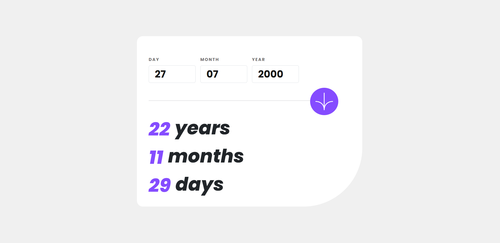

# Frontend Mentor - Age calculator app solution

This is a solution to the [Age calculator app challenge on Frontend Mentor](https://www.frontendmentor.io/challenges/age-calculator-app-dF9DFFpj-Q). Frontend Mentor challenges help you improve your coding skills by building realistic projects. 

## Table of contents

- [Overview](#overview)
  - [The challenge](#the-challenge)
  - [Screenshot](#screenshot)
  - [Links](#links)
- [My process](#my-process)
  - [Built with](#built-with)
  - [What I learned](#what-i-learned)

## Overview

### The challenge

Users should be able to:

- View an age in years, months, and days after submitting a valid date through the form
- Receive validation errors if:
  - Any field is empty when the form is submitted
  - The day number is not between 1-31
  - The month number is not between 1-12
  - The year is in the future
  - The date is invalid e.g. 31/04/1991 (there are 30 days in April)
- View the optimal layout for the interface depending on their device's screen size
- See hover and focus states for all interactive elements on the page

### Screenshot

### Links

- Solution URL: [Add solution URL here](https://www.frontendmentor.io/solutions/age-calculator-app-using-html-css-and-js-YHEhiB04dB)
- Live Site URL: [Add live site URL here](https://szidelo.github.io/age_calculator_app/)

### Built with

- Semantic HTML5 markup
- CSS custom properties
- Flexbox
- Bootsrap for using ready made classes
- Functional JavaScript Code - functions are structured in a more modular way, making it easier to understand and maintain. 

### What I learned

I have learned to organize my code as well as I can. After the app was working as it should, I reviewed my code, cleaned it up, and organized it into functions to avoid repeating myself. I also made the functions easy to read and understand.